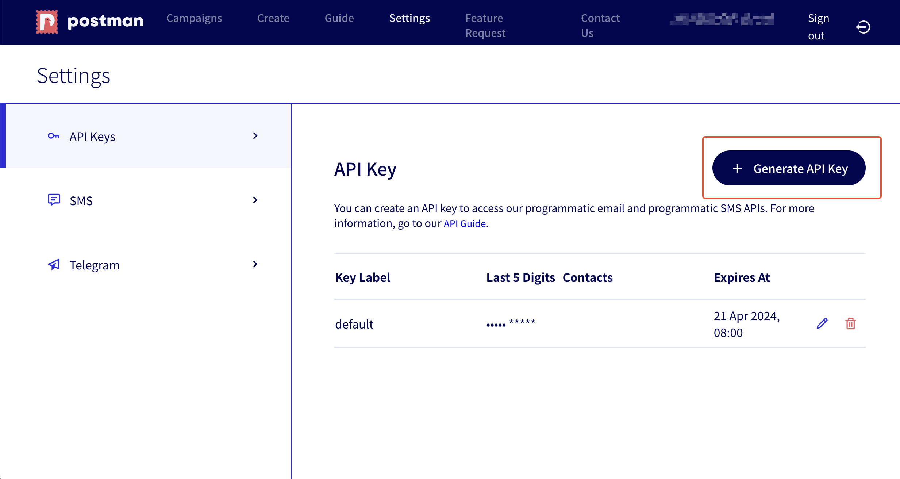
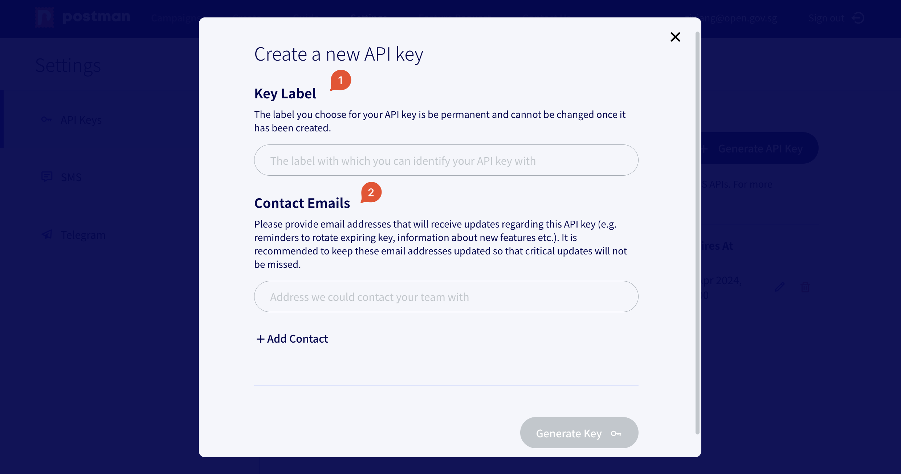
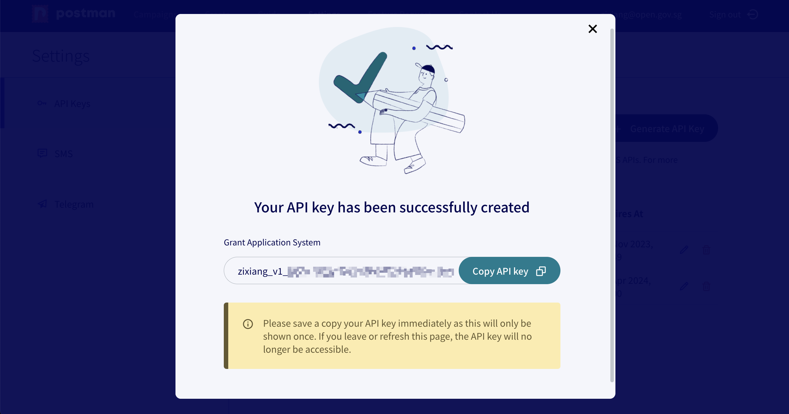
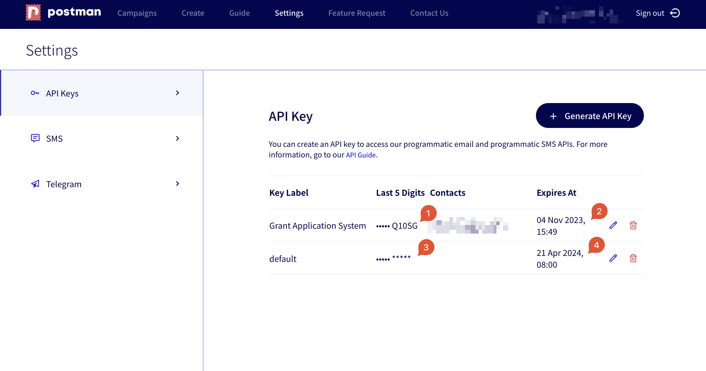

# Generate your API Key

## Log into Postman

Before you start using our API, you have to generate an API key. All users must log into our web application at `postman.gov.sg` to generate this API key. This API key can be used to make API calls and serve to authenticate you to our system.

**Bearer authentication** (also called **token authentication**) is an HTTP **authentication** scheme that involves security **tokens** called **bearer tokens**. Postman uses bearer authentication.


**Keep this API key secret.** Unauthorised disclosure of this API key will allow others to impersonate you when calling our system.


## Generate your API Key

<figure><figcaption></figcaption></figure>

To generate this token, navigate to `Settings` and click on `Generate API Key`.

<figure><figcaption></figcaption></figure>

1. We support multiple API keys per account. To distinguish among multiple API keys, choose a label for your API key. This label is permanent and cannot be changed. You can associate each label to the corresponding API key based on the last 5 digits of the API key shown on Postman's `Settings` page (see below).
2. Enter contact emails that will receive updates regarding this API key. We are aware that our API users often create accounts on Postman using email addresses that are not meant to receive incoming emails. As such, it is important to enter email addresses whose inboxes are checked regularly. You can return to this user interface to update this list of contact emails.

<figure><figcaption></figcaption></figure>

After clicking `Generate Key`, your API key will be successfully created. Your API key will be of the format `username_v1_xxxxx`. Copy the newly created API key and store it securely. We only store the last 5 digits of your API key. If you lose this API key, we will not be able to recover the API key and you will have to generate a new one.

<figure><figcaption></figcaption></figure>

1. As mentioned previously, you can associate each label to the corresponding API key based on the last 5 digits of the API key shown on Postman's `Settings` page.
2. Newly created API keys **will be valid for 6 months from the time of creation**.
3. For API keys that had been created prior to our multiple API key feature, the key label will shown as `default` and the last 5 digits are `*****`.
4. API keys that had been created prior to our multiple API key feature will expire on **21 April 2024, 08:00 GMT+8**.


To keep your system secure, Postman's API keys automatically expire and you should rotate your Postman API key on a regular basis. We will send reminders to your the contact emails provided above when prior to expiry. For more information, [click here](rotate-your-api-key.md).

