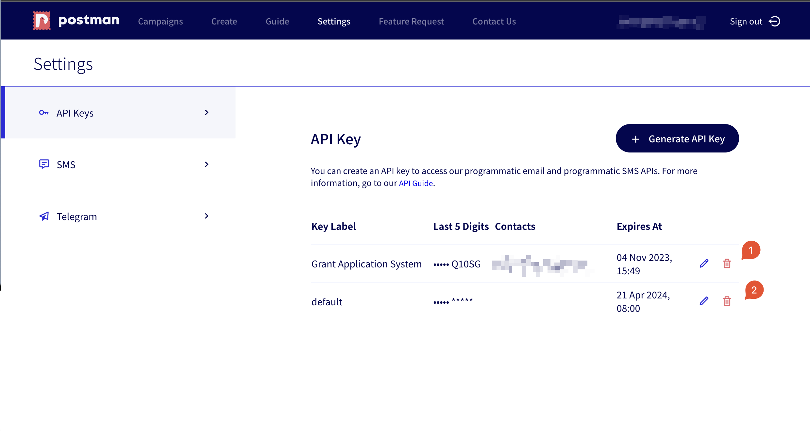
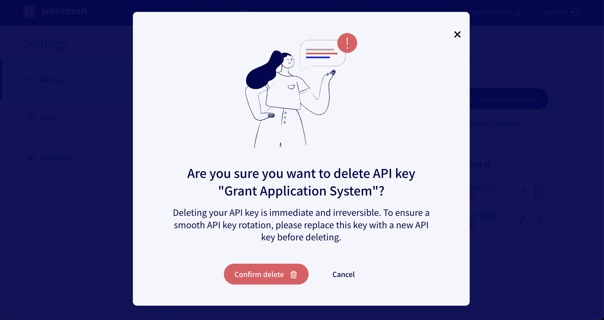

# Rotate your API Key

## Why is API key rotation necessary?

There are two scenarios where API key rotation is necessary.

First, the longer the validity period of an API key, the more vulnerable it is to risk of theft or unintentional disclosure. As a general security practice, API keys should be rotated regularly to mitigate this risk, even when there has been no known breach.

As such, Postman's API keys are designed to expire automatically. An expired key will not be able to access Postman's APIs.&#x20;

* API keys that had been created prior to our multiple API key feature will expire on **21 April 2024, 08:00 GMT+8**.&#x20;
* Newly created API keys will expire **6 months after creation**.

We encourage users to rotate API keys even more frequently if possible.

Second, if an unauthorised disclosure of an API key is discovered, API key rotation should be performed as soon as possible to prevent unauthorised usage of the API key.

### How to rotate an API key

Follow these steps to rotate your API key:

1. Create a new API key. See [this page](generate-your-api-key.md) for step-by-step instructions.
2. Update the API key used in your system to the new one and, if necessary, restart your system to load the new value.
3. Remove the old API key from your account by clicking the corresponding delete button in Postman's `Settings` page.&#x20;

<figure><figcaption>
Please ensure that you are deleting the correct API key.
</figcaption></figure>

<figure><figcaption></figcaption></figure>


Please make sure that the above steps are followed in the correct order. Otherwise, your system might experience disruption.


### Notification Schedule

Before your API key expires, we will attempt to notify you of the impending expiry using the contact emails provided when creating your API key.

The notification schedule is as follows:

* 1 month before the expiry date
* 2 weeks before the expiry date
* 3 days before the expiry date
* 1 day before the expiry date
