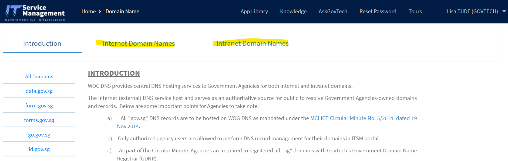

# Custom Sender Email Setup


This page is under construction.


By default, all emails will be sent from Postman's email address <mark style="color:red;">`donotreply@mail.postman.gov.sg`</mark>

## Why custom sender email?

There are two main reasons why you might want to set up a custom sender email:

1. You want to send emails branded under your own agency's <mark style="color:red;">`sender name`</mark> and <mark style="color:red;">`sender email addresses`</mark>.

<figure><figcaption>
what Sender Name and Sender Email mean
</figcaption></figure>

2. You want to use [attachment feature](send-email-api/attachments.md) on Postman Programmatic API

## How to set up custom sender email?

The following steps outlines the process of setting up custom email sender on Postman.&#x20;

_Do buffer in some time before you embark on this or let us know ahead of time if your request is urgent._&#x20;

**Step 1 - Email or submit a** [**form**](https://go.gov.sg/postman-contact-us) **to Postman team**&#x20;

Let us know that you intend to customise your email sender with the following information:

* Your use case (if you have not shared with Postman team previously)
* The sender **email address and name** that you intend to send your email out from (e.g Agency <`no-reply@agency.gov.sg>`).&#x20;
* If you have a launch timeline, please also inform us in your request for us to prioritise accordingly

**Step 2 - Postman will generate and send agency DKIM records**&#x20;

As the DKIM records is manually generated by the Postman team, this may take a few days to a week depending on our availability and your request urgency.

Postman team will send you the DKIM records in the form of CSV file, there could be up to 9 records in the file.&#x20;

**Step 3 - Agency to add DKIM records in your DNS**.


**We recommend that you add your records within 3 days of us sending the csv file to avoid delays.**&#x20;


* Create CNAME records in DNS (ITSM/DNS Provider) and make sure that you add **all records into your DNS.** Failure to do so might result in some of your email being dropped.
*   If you have both internet and intranet zones of the same domain, make sure you add it to both zones.&#x20;

    <figure><figcaption></figcaption></figure>
* _If you do not have access to your DNS records, you should speak to your ITD who has access to your agency domain (this is the domain that you want to send the email from, e.g_ agency.gov.sg_) on ITSM._

**Step 4 - Postman to add the specified sender email into our database to enable custom sender email in your account.**&#x20;

This step is done in order to enable the custom sender email on Postman.&#x20;


You should ensure that the API key you generated comes from custom sender email account that you logged into Postman to. \
\
**Example**

If you want your email to be sent from <mark style="color:red;">`noreply@agency.gov.sg`</mark>, your API key should be generated through the same email account on Postman. &#x20;


**Step 5 - Agency to verify if the configuration works.**

Postman uses Amazon SES, which may take up to 72 hours to complete the verification process in Step 2.

To check if you the domain configuration is done, you can either try sending an email using API or log into [Postman](http://postman.gov.sg/) portal and see if you are able to select your custom domain e.g `no-reply@agency.gov.sg` to send your campaign.

**If you need to send emails to Intranet .gov.sg emails**

Most agency domains would have been whitelisted on Postman but if your domain is likely a new agency domain or product from your agency and you are not sure if it has been whitelisted, you can [reach ou](https://go.gov.sg/postman-contact-us)t to us or please read [this ](sg-mail-whitelisting.md)section for more information.
