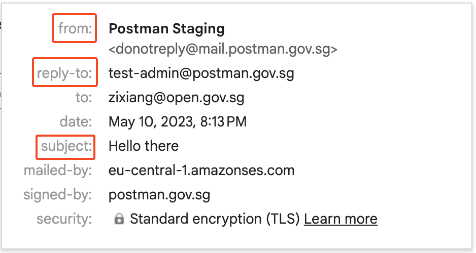

# Send Email API

This section of the guide contains information on how our API to send email works. For detailed information, please follow the links at the end of this page.

## Overview

This POST endpoint accepts a request body that contains information about the email to be sent. Each successful request to this endpoint will send a single email.

The request body can either be JSON or [multipart request](https://swagger.io/docs/specification/describing-request-body/multipart-requests/). (The latter is required for [sending attachments](attachments.md)).


[https://api.postman.gov.sg/openapi.yaml](https://api.postman.gov.sg/openapi.yaml)


## Request Body

The mandatory fields in the request body are as follows:

1. `subject` - The subject of the email.
2. `body` - The body of the email. For more information, [see here](email-body/).
3. `recipient` - The email address of the recipient. Currently, we only support sending email to a single recipient (i.e. cc and bcc are not supported).

The optional fields accepted by the endpoint are as follows:

1. `from` - The email address of the sender. If this field is omitted, the email will be sent from `Postman.gov.sg <donotreply@mail.postman.gov.sg>`. For more information, [see here](from-name-and-from-address.md).
2. `reply_to` - This sets the "Reply-To" email address, which allows sending an email from one email address and telling the recipients to reply to another address. If this field is omitted, it will default to the sender's email address.
3. `classification` - This field accepts one of the following values: `URGENT`, `FOR_ACTION`, and `FOR_INFO`. For more information, [see here](email-tagging-and-classification.md).
4. `tag` - This fields accept a user-defined string. For more information, [see here](email-tagging-and-classification.md).
5. `attachments` - This field accepts a list of attachments and is only available via multipart requests. For more information, [see here](attachments.md).

See the screenshot below for an example of how some of these fields correspond to what an email recipient sees:



### Example API Call

```bash
curl --location --request POST 'https://api.postman.gov.sg/v1/transactional/email/send' \
--header 'Authorization: Bearer your_api_key' \
--form 'subject="Test email"'
--form 'body="<p>Hello <b>there</b></p>"' \
--form 'recipient="recipient@email.com"' \
```

This is the minimum required request body to send an email. The email will be sent from `Postman.gov.sg <donotreply@mail.postman.gov.sg>`.

## API Response

For general information about our API response formats, [see here](../../overview/api-response-formats.md).

### Status Code

In the event of a successful request, the response status code will be `201 Created`.


Sending emails is an asynchronous process. After receiving your API call, Postman will attempt to send the email via our email service provider. As such, a successful API request simply means the request has been made successfully. To return a response to each API call promptly, there is not enough time to ensure that your message has been sent or delivered successfully. To check on the status of your email, you should call [this endpoint](../programmatic-email-api/get-email-by-id-api.md).


For unsuccessful requests, we will provide an appropriate status code and error message to indicate the reason for the failure.

For this API, here is a (non-exhaustive) list of reasons why a request may fail:

1. The request body is invalid because of missing mandatory fields or invalid field values. The error message will provide more details.
2. The recipient has been blacklisted. For more information, [see here](recipient-blacklist.md).
3. The user has exceeded the rate limit. For more information, [see here](rate-limit.md).
4. The subject or the body of the email is empty after applying [HTML sanitisation](email-body/#html-sanitisation).
5. Internal server error. Unlike the previous reasons (which have a `4xx` error code), the error code for this will be `500`. (This is rare and unlikely to happen.)

### Response JSON Object

For the API call [illustrated above](./#example-api-call), the response JSON object would be as follows:

```json
{
  "id": "42",
  "from": "Postman.gov.sg <donotreply@mail.postman.gov.sg>",
  "recipient": "recipient@email.com",
  "params": {
    "body": "<p>Hello <b>there</b></p>",
    "from": "Postman.gov.sg <donotreply@mail.postman.gov.sg>",
    "subject": "Test email",
    "reply_to": "user@agency.gov.sg"
  },
  "attachments_metadata": null,
  "status": "ACCEPTED",
  "error_code": null,
  "error_sub_type": null,
  "created_at": "2023-05-10T03:03:55.406Z",
  "updated_at": "2023-05-10T03:03:55.406Z",
  "accepted_at": "2023-05-10T03:03:55.406Z",
  "sent_at": null,
  "delivered_at": null,
  "opened_at": null,
  "classification": null,
  "tag": null,
}
```


The user is strongly advised to save the `id` field (`42` in the example), which is a unique identifier for the email. This can be used to check the status of the email via a separate endpoint that will return a similar JSON object. For more information, [see here](../get-email-by-id-api.md).


## Links

* [Email Body](email-body/)
* [Recipient Blacklist](recipient-blacklist.md)
* [Attachments](attachments.md)
* [Images](email-body/images/)
  * [Internet Images](email-body/images/internet-images.md)
  * [Content-ID Images](email-body/images/content-id-images.md)
* [Rate Limit](rate-limit.md)
* [Email Tagging and Classification](email-tagging-and-classification.md)
* [How Email Sending Works](how-email-sending-works.md)
