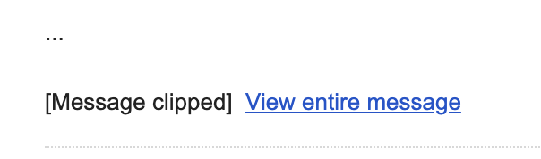

# Email Body

The `body` field in the request body is the email body. API user can provide the email body in either plain text or HTML format.

## Size Limit

The `body` field can accept up to 1MB of data. If the email body exceeds the size limit, the API will return a `400 Bad Request` error.

In fact, we recommend that you keep your email body within 100KB for the following reasons:

- The larger your email body, the longer it takes for your API call to complete.
- Popular web clients like Gmail will clip emails that are larger than this size.
  - This means users will have to click on a link to view the full email, resulting in a worse user experience.
  - To track open rates, we embed a 1x1 pixel image in the email. If the email is clipped, there is a chance that the image will not be loaded, thus affecting the accuracy of the open rate.
  - The exact clipping limit is not known, but it is estimated to be around 102KB.

<figure><figcaption>A clipped message on Gmail</figcaption></figure>

## HTML Sanitisation

The `body` field passed in the request body will be sanitised to prevent XSS attacks. The exact sanitisation process can be [found here](https://github.com/opengovsg/postmangovsg/blob/master/shared/src/templating/xss-options.ts).

The easiest way to check the HTML output of your sanitised input is to make us of this [email editor](https://postman-editor.vercel.app/).

This same sanitisation process is applied to campaign emails.

## Images

For more information on embedding images within the body of your email, go to [this section](./images/README.md).
