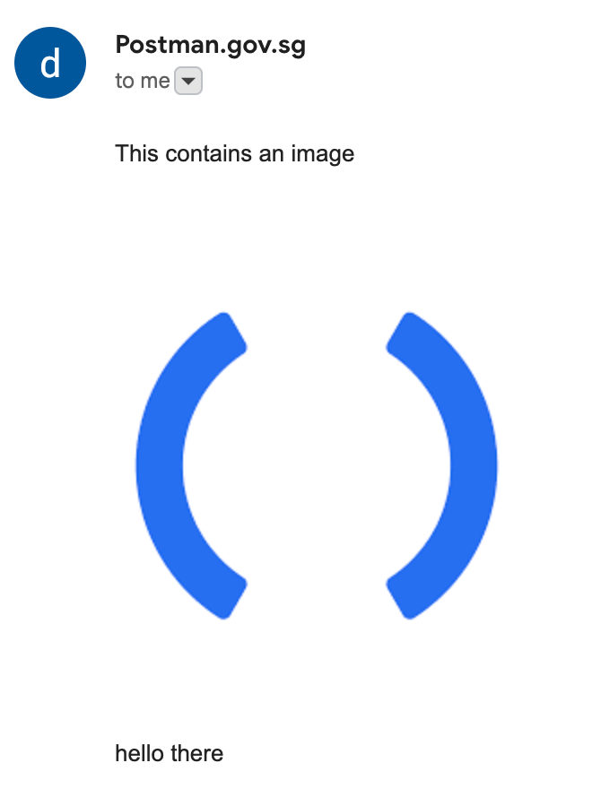

# Linked Images

## How It Works

Linked images are images hosted on a server and displayed in the body of an email via HTML image tags. The email client will retrieve the image from the source indicated in the `img` tag.

An example linked image is: ``.

## Recommended for Same Images Across Multiple Emails

If you are using the same set of images across multiple emails, an easy way to use linked images in your email is to upload the image to a service like GoGovSG and reuse the same `img` tags in your emails.

For step-by-step instructions on how to upload images to GoGovSG, [see this](../../../../../campaign-guide/email/format-bar.md#embedding-an-image-in-email).

## Unique Image for Each Email

If you are embedding a unique image for each email, you may consider:

* Programmatically uploading your image to a file hosting service
  * Currently, we do not provide such a service. However, we are looking into possible solutions, please [contact us](https://go.gov.sg/postman-contact-us) if this could be helpful to your agency.
* Using [content-ID images](content-id-images.md)

## Sample API Call

```json
{
  "subject": "Test subject",
  "body": "<p>This contains an image</p><br><br><br><br><p>hello there</p>",
  "recipient": "recipient@agency.gov.sg"
}
```

The resulting email:

<figure><figcaption></figcaption></figure>
