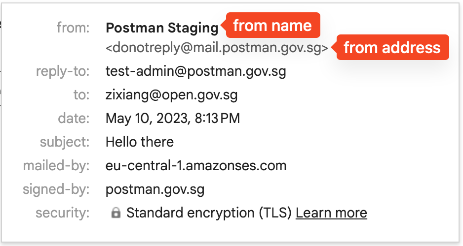
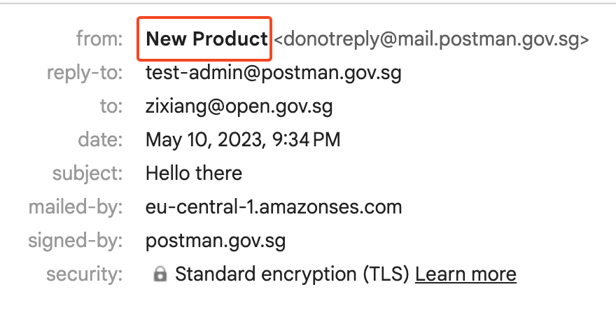
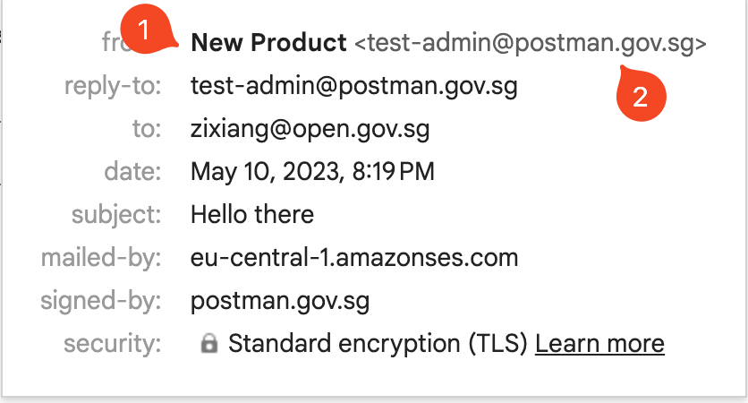

# From Name and From Address

## From Name vs From Address

The `from` field of an email contains `from name` and `from address`. This is illustrated in the image below:



If the `from` field in the JSON body of the API call is omitted, the `from name` and `from address` of an email sent via our API  are `Postman.gov.sg` and `<donotreply@mail.postman.gov.sg>` accordingly.

## Changing From Name

The `from name` of an email can be changed by the API user.

For example, using the follow JSON body in the API call, the user can change the `from name`:

```json
{
  "recipient": "zixiang@open.gov.sg",
  "subject": "Hello there",
  "body": "What's upppp",
  "from": "New Product <donotreply@mail.postman.gov.sg>"
}
```

The email recipient will see the following:

<figure><figcaption></figcaption></figure>

For users that wish to customise their emails without going through the hassle of setting up a [custom from address](../custom-from-address.md), this is an intermediate solution used by our existing users.

## Sending via Custom Domain

Users may wish to send emails using a custom `from name` as well as a custom `from address` (i.e. any email address that is not the default `<donotreply@mail.postman.gov.sg>`. Setting up a custom from address is necessary; for more information, [see here](../custom-from-address.md).


Create an account on Postman using the email address that you want to send your email from.

For example, if you want your email to be sent from <mark style="color:red;">`no-reply@agency.gov.sg`</mark>, you should log into Postman using this email address and generate your API keys on the dashboard.


To make use of the custom from address, the JSON body of the API call is:

```json
{
  "recipient": "zixiang@open.gov.sg",
  "subject": "Hello there",
  "body": "What's upppp",
  "from": "New Product <donotreply@mail.postman.gov.sg>"
}
```

The recipient will see:

1. A custom from name `New Product`
2. A custom from address `<test_admin@postman.gov.sg>`


