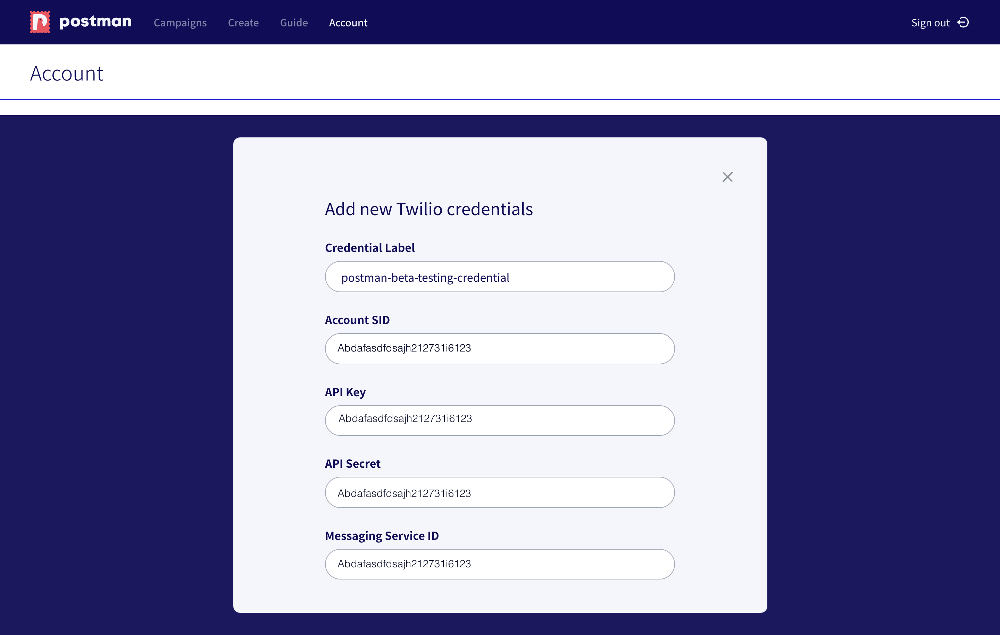
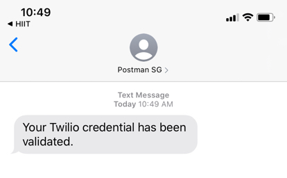

# Step 6: Fill in your Twilio credentials in Postman!

Why is this step needed? You can think of credentials as a passcode that you need to enter into a keypad in order to get into a door. We need your credentials to contact Twilio's API.


If you want to be able to reuse your credentials, you need to save them under settings.

Otherwise, the credentials will not be saved, and you will need to key them in each time you send a campaign. We recommend you do the one-step set-up in `settings` to save you the time in the future.


#### How do I set up?

First, log into your [Postman](http://localhost:5000/s/qQYf99nZtDsAL7kqovkU/) account using your official government email address.

_(If you prefer to watch a video on how to set up, scroll to the bottom of this page)_

Click on `Settings` on your Postman dashboard.

<figure><figcaption>
Click "Settings"
</figcaption></figure>

Add in your Twilio credentials - you should have saved the 4 components needed, as advised to you in [step 4](../step-4-configure-your-twilio-account/).

Note that the _credential label_ is just a friendly name for your to keep a record of these credentials.

Then, key in your phone number to validate your credentials.

Receive a success message once your credentials have been validated.

An SMS will also be sent to your mobile number.

#### Congratulations! At this step, you have completed the set-up.

You can now start sending campaigns with your own credentials. You will be billed by Twilio for the SMSes that you send.

## Remove your credentials

If you want to remove your credentials, simply click on the trash can icon beside the credentials that you want to delete.


**Deleting your credentials is irreversible.** We will prompt you to make sure that it is the right credential that you want to delete.


<figure><figcaption>
Delete your credentials
</figcaption></figure>

#### Here's a video on setting up your credentials, if you prefer!


