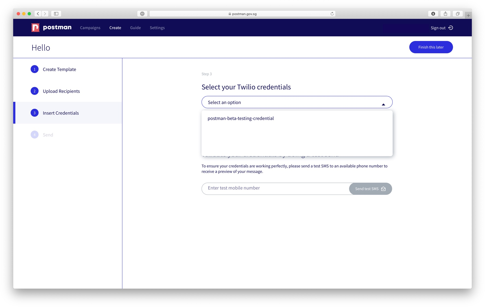

# How do I send a campaign with my saved SMS credentials?

Once you have saved your Twilio SMS credentials under settings, you can choose the credentials from the dropdown list when it prompts you to insert credentials.

Some large agencies do this, especially when a shared email address is used for log-in, and users require different credentials for different campaigns for accountability and governance purposes.

