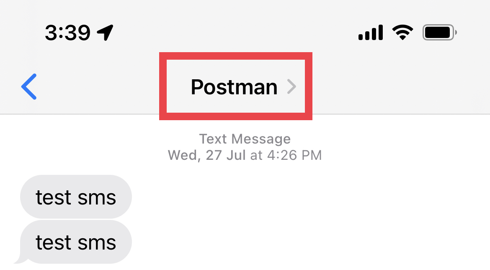

# Step 1: Sender ID Registration

As part of national scam prevention efforts to filter out non-legitimate SMSes to citizens, IMDA has necessitated the registration of SMS Sender IDs for all organisations in Singapore on the SMS Sender ID Registry (SSIR), including public agencies, from 31 January 2023. You can read more about this new policy [here](https://www.imda.gov.sg/Content-and-News/Press-Releases-and-Speeches/Press-Releases/2022/Full-SMS-Sender-ID-Registration-to-be-required-by-January-2023). The Sender ID refers to the name that you see at the top of an SMS sent to you by an officially-registered organisation.

<figure><figcaption>
Example of a Sender ID
</figcaption></figure>

Some large agencies might already have registered their Sender IDs. This is especially the case for generic agency-name Sender IDs like `MSF` or `MTI`. If you are unsure if the Sender ID you would like to use has already been registered by your agency, please do check internally before submitting your registration.

#### How do I register for a Sender ID?

You will need to register via the SSIR portal [here](https://smsregistry.sg/web/login). Approval will take a few days as the Singapore Network Information Centre (SGNIC) - a wholly-owned subsidiary of IMDA - will need to conduct specific name and homoglyphic checks on your desired Sender ID. More information on Sender IDs and fees imposed by IMDA [here](https://www.sgnic.sg/faq/sms-sender-id-registry).

<figure><figcaption>
SSIR portal
</figcaption></figure>

Want to know more about Sender IDs? We have compiled commonly-asked questions by agency users like yourself [here](https://guide.postman.gov.sg/campaign-guide/sms/more-about-senderid-registration).
