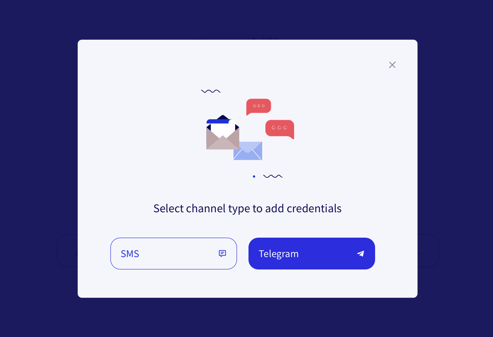
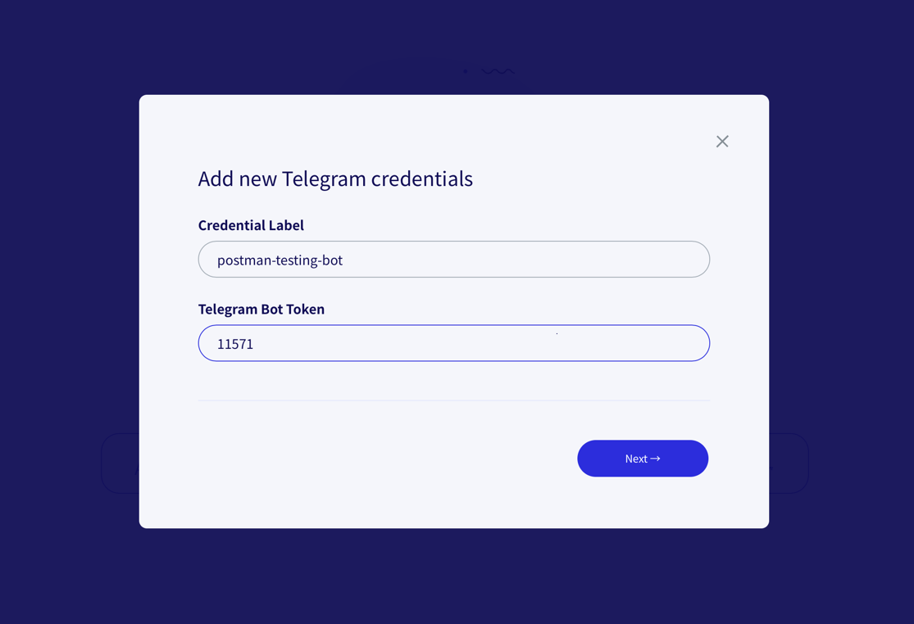
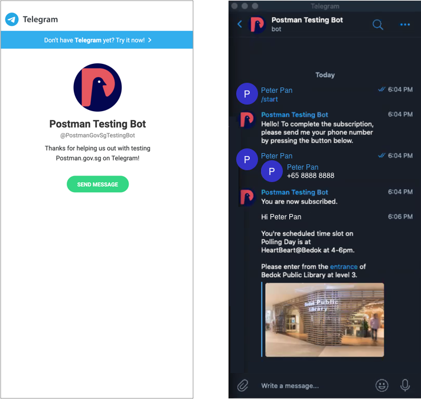

# Add Telegram Bot Token in Postman


You can watch the video on Postman's [workplace group](https://onepublicservice.workplace.com/groups/postman.gov.sg/permalink/2722772607991773/) to go through the set-up.


### Save your bot token under settings

Bot token is the way that Postman recognizes your agency's bot. We need your bot token to contact Telegram's API. If you want to be able to reuse your bot, you need to save them under settings.

### Can multiple people from my agency add the bot credential under settings?

Yes, you may have a few people who are sending things out from Postman on a regular basis and you just need to save the same bot token under settings to share the bot.

### **Step 1**: Select Add credentials

.png>)

### **Step 2:** Select Telegram

### Step 3: Copy & paste your Telegram bot token from **BotFather** under `Telegram Bot Token`

Subscribe to your own bot first (see [below](https://guide.postman.gov.sg/campaign-guide/getting-started/telegram-bot/add-telegram-bot-token-in-postman#how-to-subscribe-to-your-bot)) and then you can enter your phone number here to validate the Telegram bot token.

If the set up is correct, you should receive a message through Postman on Telegram through your agency's bot.

## How to subscribe to your bot?

Go to the telegram link for your bot `https://t.me/[your bot name]`

1. Talk to your bot with `/start`
2. Send the bot your phone number by clicking on the **button**


Do not type your phone number. Postman will only receive the subscriber's phone number in our system when the button is clicked.


