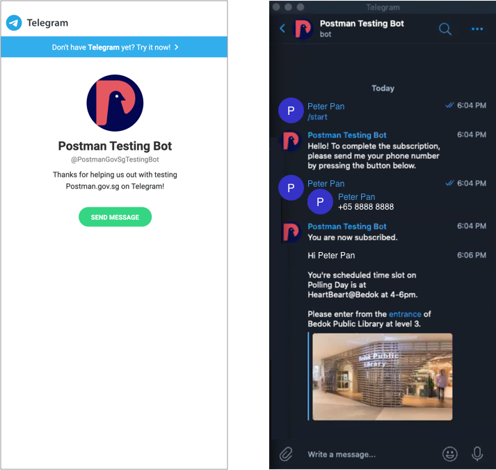

# Instructions for Recipient Onboarding

In order for PostmanSG to send messages to your subscribers, we need the subscribers to add the bot and send their mobile number to us. This is like adding a friend to your contacts list. The link to add the bot should be `https://t.me/[your bot name]` .

## Steps for Subscribers for Telegram Bot Onboarding

Tell your subscriber to go to

1. `https://t.me/[your bot name]` (see example figure on the left)
2. Talk to your bot with `/start`(see example figure on the right)
3. Send the bot his or her phone number by clicking on the **button**


Do not type your phone number. PostmanSG will receive only the subscriber's phone number when the button is clicked.


Once the subscribers have subscribed to your bot, you can upload their phone number as a contact list in PostmanSG in order to send messages to them.

## How do I send the Telegram bot link out to the recipient?

Depending on your use case, you can send the recipient an SMS or Email to let them know you have this new bot feature for your agency.

## How should I explain the Telegram bot feature to the recipient?

The recipient can choose to receive relevant information from the agency by subscribing to the bot. It is like a newsletter subscription. If the information is no longer relevant for them, they can choose to unsubscribe by deleting the bot.

## What if my recipient changes mobile numbers?

In such instances, aside from updating your own contact list of recipients, please also get in touch with us [here](https://form.gov.sg/#!/62b19812ff209e00126f2c47) so that we can perform back-end checks and/or amendments to ensure that the recipient can continue to receive your Telegram messages.
