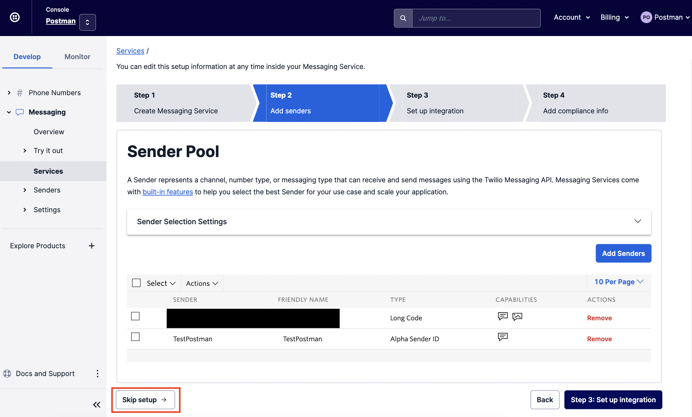

# Step 3c: Set Up Your Billing Details

2. Set up your billing details.


**Information about Twilio billing**

Twilio works like a prepaid phone card. You will need to top up the credits in your Twilio account to start sending SMSes. We strongly recommend using your **corporate credit card** for this.

The alternative is direct invoicing, which is only available as an option if you send more than 25,000 SMSes a month (or meet the minimum spend of USD$12,000 annually). If this is your preferred option, please contact us so we can put you in touch with our Twilio account manager.

_Note: if you do not upgrade your account, you will not be able to send SMSes with your registered alphanumeric SenderID._


#### To set up your billing options, go to Billing > Manage Billing > Upgrade.

<figure><figcaption>
Fill in the requested information
</figcaption></figure>

<figure><figcaption>
Insert your tax number (GST number)
</figcaption></figure>

<figure><figcaption>
Key in your corporate credit card details
</figcaption></figure>
