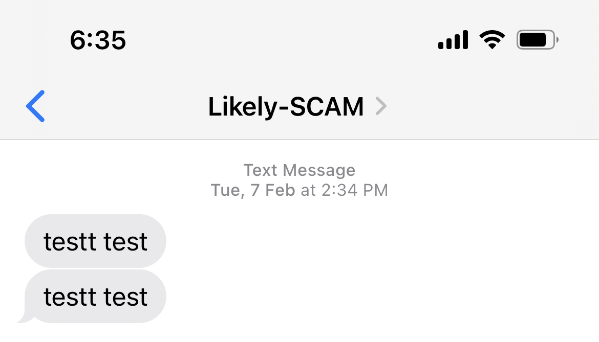

# More about Sender ID registration

Necessary registration information has already been provided to you [here](../onboarding-overview/README.md). In this section, we include commonly-asked questions by agencies that have onboarded onto Postman and gone through the Sender ID registration process themselves. We hope this will be useful to you!

#### Do I really need to register for a Sender ID?

Yes - this is a mandatory initiative by SGNIC/IMDA. If you do not register, any SMS that you send to a Singapore number will be reflected as `Likely-SCAM,` regardless of where the recipient is in the world.This also means that your recipients may not trust your SMS content. IMDA also has eventual plans to block all SMSes with unregistered Sender IDs - this means that your messages will not reach your recipients at all.

<figure><figcaption></figcaption></figure>

#### What if I am intending to only send a one-off campaign?

We understand that one-off campaigns means that you may be registering a Sender ID that will only be used once, which may not justify the costs. In such situations, we generally advise agencies to check internally to see if already-registered Sender IDs can be "borrowed" to be used for this campaign.

#### If I don't use Postman to send SMSes, does that mean I don't need to register for a Sender ID?

No - regardless of whether you use Postman, you will still need to register for a Sender ID as long as you are intending to send SMSes on behalf of your agency. This is a nationwide policy mandated by IMDA.

#### Are there fees for registering my Sender ID?

Yes - SGNIC imposes a one-time setup fee of S$500 for each registered organisation, and an annual charge of S$200 for each registered Sender ID. Read more [here](https://www.sgnic.sg/smsregistry/overview).

