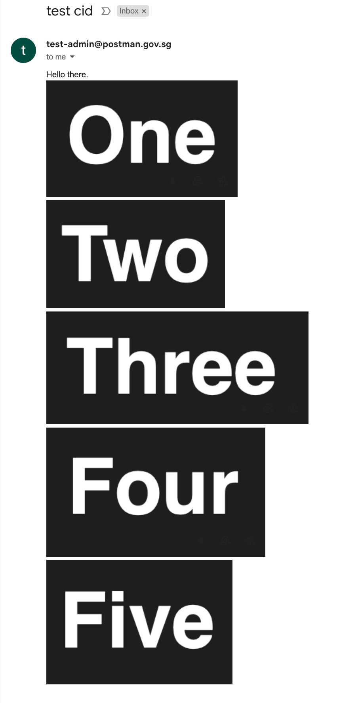

# Content-ID Images

## How It Works

Content-ID images work by attaching the image to the email you send and then using standard HTML image tags that reference that image to eventually embed it in the email when the user opens it.

## Not Recommended for Same Images Across Multiple Emails

If you are using the same set of images across multiple emails, we advise you to look into using linked images for the following reasons:

- As the same images are being used, attaching the same image to each email is inefficient and bad for the environment
- Content-ID images are larger in size as the image is attached to the email. This slows down your API calls and increases costs.

For more information, [see here](linked-images.md).

## Unique Image for Each Email

Content-ID images can be used for embedding dynamically generated images in your emails. This is a reasonable alternative for agencies that are unable to host images on the Internet.

## Using our API

To support content-ID images, we have parsed each attachment to add a `cid` field based on the order in which they are attached. This allows the first attachment to be referenced by `cid:0`, the second by `cid:1`, and so on. You can then use these `cid` values in your HTML image tags.


Note that the `cid` values are zero-indexed, i.e. the first attachment is `cid:0`, the second is `cid:1`, and so on. This `cid` field is added for all files, including non-image files.


As content-ID images work by attaching emails, you will need to fulfill the requirements

### Example API Request

The following example shows how you can use the `cid` field to embed images in your email.

```zsh
curl --request POST \
  --url https://api.postman.gov.sg/v1/transactional/email/send \
  --header 'Authorization: Bearer <API-KEY>' \
  --header 'Content-Type: multipart/form-data' \
  --form recipient=recipient@agency.gov.sg \
  --form from=sender@agency.gov.sg \
  --form 'subject=test cid' \
  --form 'body=Hello there.
<br>

<br>

<br>

<br>

<br>

' \
  --form 'attachments=@/path/to/attachment/1 one.png' \
  --form 'attachments=@/path/to/attachment/2 two.png' \
  --form 'attachments=@/path/to/attachment/3 three.png' \
  --form 'attachments=@/path/to/attachment/4 four.png' \
  --form 'attachments=@/path/to/attachment/5 five.png'
```

The resulting email:
<figure><figcaption></figcaption></figure>
